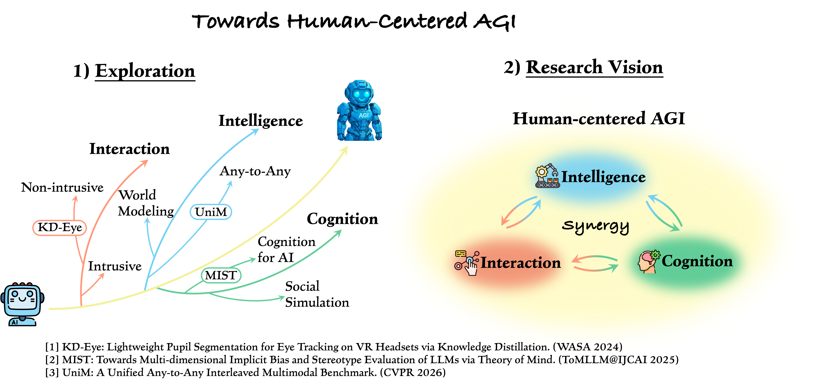

## About Me

Greetings and thanks for visiting my homepage. 

My name is Yanlin Li. I am a master student at [School of Computing](https://www.comp.nus.edu.sg/), [National University of Singapore](https://nus.edu.sg/), under the supervision of [Prof. Mong-Li Lee](https://www.comp.nus.edu.sg/~leeml/) and [Prof. Wynne Hsu](https://www.comp.nus.edu.sg/~whsu/). And also I am mentored by [Dr. Hao Fei](https://haofei.vip/) and [Dr. Shengqiong Wu](https://sqwu.top/). Before that, I obtained the degree of Bachelor of Software Engineering at the [School of Software](https://www.sc.sdu.edu.cn/), [Shandong University](https://www.sdu.edu.cn/) in China.

I am eager to explore novel areas of research (current attempts are to define future directions) and I am also willing to seek some external collaborations. Contact me if you have any leads! Deeply obliged.

## Research Interests

I believe that the development of technology should always be human-centered, and my long-term research goal is to build **Human-Centered AGI**.

To advance this vision, I focus on three interconnected aspects:

  

- **Interaction**: Only with natural and intuitive multimodal interaction can AI truly align with human habits, providing personalized and collaborative experiences.
- **Cognition**: Only by understanding and simulating human cognitive mechanisms can AI better align with human ways of thinking and achieve genuine human–machine understanding.
- **Intelligence**: Only by enhancing the overall performance of reasoning and perception can AI demonstrate efficient and flexible abilities in complex and dynamic environments, better serving human needs.

## Experiences
- **Research Assistant**, Centre for Trusted Internet Community, NUS, advised by Dr. Hao Fei, Prof. Mong-Li Lee and Prof. Wynne Hsu. [12/2024-now]
- **Research Assistant**, AIoT Lab, SDU, advised by Prof. Yiran Shen. [10/2022-06/2024]

## News
- **[04/2026]** I get the **CS PhD** offer from **NUS**!
- **[04/2026]** Our CVPR 2026 paper UniM has been accepted by **VALSE 2026**. See you in Wuhan!
- **[04/2026]** One paper has been accepted by **CogSci 2026** (CCF-B).
- **[02/2026]** One paper has been accepted by **CVPR 2026** (CCF-A).
- **[07/2025]** One paper has been accepted by **ToMLLM@IJCAI 2025**.
- **[01/2025]** I join CTIC@NUS as a research assistant, advised by Dr. Hao Fei, Prof. Mong-Li Lee and Prof. Wynne Hsu.
- **[08/2024]** I am honored to be awarded the **NUS GRTII Master's Scholarship** (SGD 45,000).
- **[05/2024]** One paper has been accepted by **WASA 2024** (CCF-C).
- **[05/2024]** I am honored to be the **Meritorious Winner** in The Interdisciplinary Contest in Modeling (ICM). Thanks to my collaborators.
- **[01/2024]** I am glad to be selected an **outstanding graduate (undergraduate)** of Shandong University. 
- **[10/2022]** I join AIoT@SDU as a research assistant, advised by Prof. Yiran Shen.







